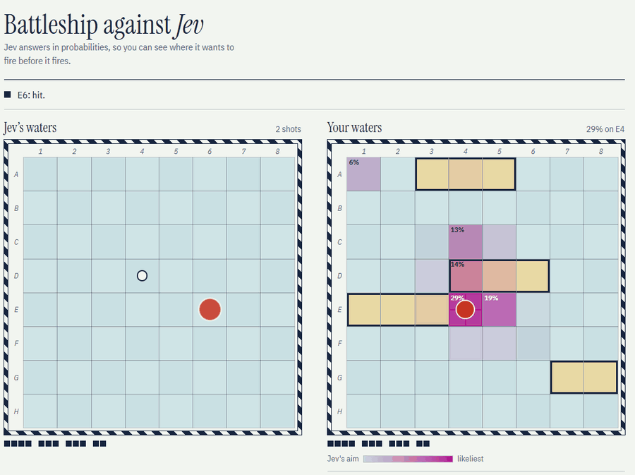
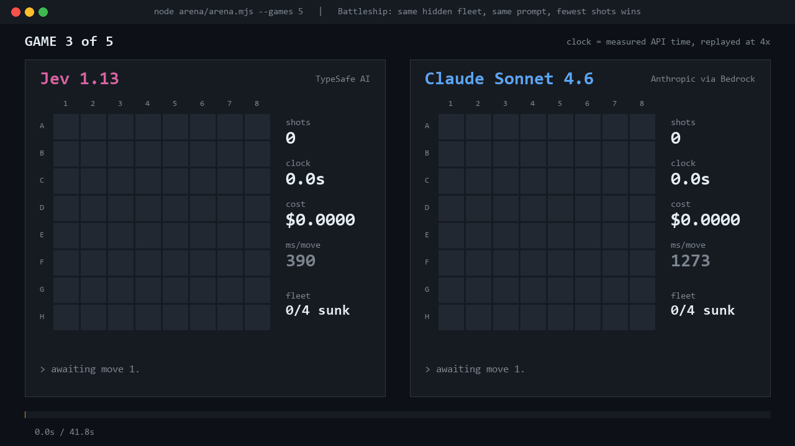
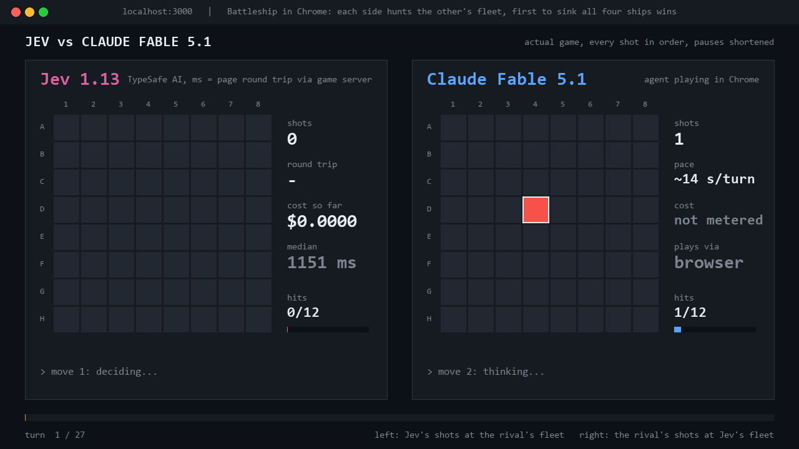

# Battleship against Jev

Jev is [TypeSafe AI](https://typesafe.ai)'s System One model. It does not write text. You hand it a
state and a set of labelled options, and it hands back a probability for every option. This repo
tests what that is worth on a task with an unambiguous score, Battleship, in two forms:

- **a web game** where a person plays Jev and sees its shot distribution printed on their own chart
- **a CLI arena** where Jev and a general-purpose LLM attack identical hidden fleets, fewest shots wins

Play it at **[jev-battleship.vercel.app](https://jev-battleship.vercel.app)**.



## One rule: no strategy in code

Local code may only check that a shot is legal. No probability maps, no "there is a hit, so shoot
next to it" heuristic, no candidate filtering, no forced moves. Whatever skill shows up has to come
out of the request.

That rule made the first version bad. Jev needed about 48 shots to clear a fleet, against 57 for
firing at random. It would find a miss and keep extending a line of misses across the board, and
rewording the instructions moved almost nothing.

What worked was changing what each option says about itself. Every untested square is offered as an
option whose description states only what has been observed around it: its four neighbours, then the
cells one further in the same four directions.

| Prompt | Mean shots over 28 seeded fleets |
|---|---:|
| First version | 48.6 |
| Each option lists its four neighbours | 30.5 |
| Neighbours, then one cell further (shipped) | 29.9 |
| Probability density solver, offline yardstick | 28.6 |
| Random fire | 59.5 |

Jev cannot read spatial structure off a grid, but it reads option descriptions very literally. The
variants that lost, the held-out runs and the diagnostic positions are in
[`tuning/REPORT.md`](tuning/REPORT.md). An exact opening request is in
[`jev-request-example.json`](jev-request-example.json).

## Arena: two models, one fleet, fewest shots wins

```
node arena/arena.mjs --games 5 --opponents sonnet,minimax
```

Both captains attack the same hidden fleet with the same request and the same option order. Ties go
to whoever shot first, which alternates by game. Jev takes the structured request natively. The text
models get the same JSON plus a format-only instruction to answer `{"choice": "C4"}`, at temperature
0 with no extended thinking. An answer that is not an untested cell is a wasted shot: it counts and
the board does not change. Transport errors are retried and never count. Per move latency, tokens and
list-price cost are recorded for every turn in `arena/results.json`, and a rerun resumes rather than
replaying finished games.

Best of five, seed 20261501:

| | Jev 1.13 | Claude Sonnet 4.6 | | Jev 1.13 | MiniMax M3 |
|---|---:|---:|---|---:|---:|
| Series | 2 | **3** | | **3** | 2 |
| Mean shots | 33.0 | **30.4** | | **36.4** | 37.2 |
| Median latency per move | **388 ms** | 1,297 ms | | **388 ms** | 1,010 ms |
| API time, 5 games | **73 s** | 232 s | | **81 s** | 221 s |
| Cost, 5 games | **$0.029** | $1.72 | | **$0.031** | $0.163 |
| Answers that were not a legal cell | 0 | 10 | | 0 | 1 |

Jev lost the Sonnet series by about two and a half shots a game, at one sixtieth of the cost and a
third of the latency. It won the MiniMax series.



`python arena/render.py` rebuilds that replay and the scorecard from `arena/results.json`.

## Browser matches

Two frontier models also played Jev as agents driving the real web page, each side hunting the
other's fleet, first to sink all four ships wins.

| | Claude Fable 5.1 | Astra (Codex) |
|---|---:|---:|
| Shots the rival needed to win | 27 | 37 |
| Jev's hits, out of the 12 it needed | 10 | 10 |
| Jev's cost for the match | $0.0043 | $0.0055 |

Jev lost both, two hits short each time. `python arena/render_chrome.py` renders these from
[`arena/chrome/matches.json`](arena/chrome/matches.json).



A caveat on latency: in the browser matches Jev averaged 814 ms and 963 ms per call, not 388 ms.
The agents took 14 to 19 seconds per turn, so most calls paid for a fresh connection. Quote the
arena figure for back to back use, and the browser figure for a slow interactive turn.

## Run it locally

```
npm install
cp .env.example .env        # add TYPESAFE_API_KEY, required for live decisions
npm run dev                 # http://localhost:3000
npm test                    # request building and shot selection
npm run probe               # live benchmark, Jev vs density vs random on seeded fleets
npm run probe -- 8 --seed 20260920 --out probe-results.json
```

`npm run probe -- --request-module ./tuning/variant-shot.mjs` loads an archived prompt for a before
and after comparison. The arena needs `AWS_BEARER_TOKEN_BEDROCK` for Claude on Bedrock and
`MINIMAX_API_KEY` for MiniMax. Rendering needs Python with Pillow, plus ffmpeg on PATH.

## Deploy

[](https://vercel.com/new/clone?repository-url=https://github.com/sah1l/jev-battleship&env=TYPESAFE_API_KEY&envDescription=Your%20TypeSafe%20AI%20key,%20used%20server%20side%20only)

The game is a static page plus one serverless function, so any Vercel project works:

```
npm i -g vercel
vercel link
vercel env add TYPESAFE_API_KEY production
vercel --prod
```

The API key stays on the server. Requests to `/api/shot` are same-origin checked, rate limited per
instance, and validated before they reach Jev. If you deploy your own copy, change `og:url` and
`og:image` in `public/index.html` to your domain: those have to be absolute, because LinkedIn and X
will not resolve a relative image.

## What is in here

| Path | |
|---|---|
| `public/index.html` | the game: placement, rules, scoring, heatmap, rendering |
| `api/shot.js` | builds Jev's request, validates its answer, picks the highest ranked legal cell |
| `server.mjs` | local preview that routes `/api/shot` to the same handler Vercel runs |
| `probe.mjs` | live benchmark against a density solver and random fire |
| `arena/arena.mjs` | the model vs model CLI |
| `arena/render.py`, `arena/render_chrome.py` | replays and scorecards from the saved results |
| `tuning/` | the prompt study: variants, diagnostic positions, grading, report |

Scoring in the web game: a win is 500, plus 10 for each of the 64 shots not needed, plus 25 for each
hit Jev still needed. A loss scores 25 per hit landed, so any win beats any loss.

## License

MIT. See [LICENSE](LICENSE).
